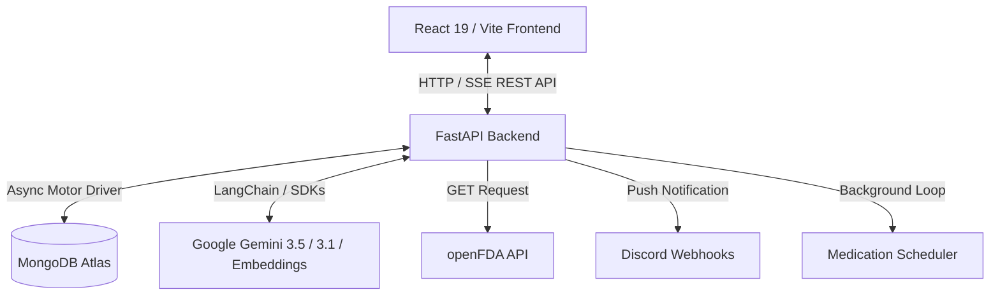

# MedEase: Intelligent Medication Assistant

MedEase is a healthcare web application designed to help patients manage complex medication schedules safely and effectively. By leveraging cutting-edge LLMs (Google Gemini 1.5 & 3.5) and openFDA reference databases, MedEase AI extracts drug info from prescription bottle images or speech inputs, screens for potentially dangerous drug-drug and drug-food interactions, and generates optimized daily schedules that fit the user's routine.

---
## Inspiration
Our project was inspired by a very common real-world problem: people forgetting to take their medications or supplements correctly. Many individuals — especially elderly users, immigrants with language barriers, students taking supplements, and busy adults — struggle to manage multiple medications with different schedules, food restrictions, and timing requirements.

That idea became MedEase, an intelligent medication scheduling assistant that helps users organize medications, generate optimized daily plans, and simplify medical information using AI.

## What it does
MediEase helps users:
* Add and manage medications
* Generate optimized daily medication schedules
* Track medication history and adherence
* View a “Today Dashboard” with upcoming doses
* Receive medication reminders through Discord webhooks
* Use AI simplify mode to explain medications in easier language

One of our key features is the Daily Plan Generator. Users can:

* Select medications from their existing medication list
* Enter wake-up time, sleep time, and meal times
* Let AI generate an optimized medication schedule
The AI attempts to create a schedule that minimizes conflicts and improves convenience for the user.

## Key Features

*   **📷 Multimodal Medication Scanning**: Scan medication labels via images (OCR) or voice input. MedEase AI identifies the active ingredients and uses the **openFDA API** as a ground truth reference to build structured medication profiles.
*   **⚠️ Smart ADE & Interaction Detection**: Automatically flags potential Adverse Drug Events (ADEs) and adverse interactions between newly scanned drugs and your existing medications or food/alcohol.
*   **📅 Optimized Master Schedule Generator**: Inputs user routines (wake, sleep, and meal times) and automatically maps out a chronological schedule, spacing out interacting medications (e.g., by 2-4 hours) while keeping meal-bound drugs aligned with breakfast, lunch, or dinner.
*   **💬 MedEase AI Assistant with Tool-Calling**: An intelligent chat assistant equipped with specialized tools to:
    *   Perform semantic vector search (`models/gemini-embedding-001`) over the user's current medication database.
    *   Determine missed or delayed doses based on the current system time.
    *   Perform live interactive edits to the schedule (adding, removing, or moving medications) and track changes.
    *   Provide real-time Server-Sent Events (SSE) streaming chat replies.
*   **⏰ Discord Webhook Notification System**: Integrated background scheduler (`scheduler.py`) that monitors the database and pushes automated rich reminders to users' custom Discord webhooks at their exact dose times.
*   **📊 Adherence Logs**: Features a calendar and log list tracking taken/skipped/missed medications to support patient compliance.

---

## Architecture & Tech Stack

MedEase AI is built as a split-architecture application:



### Backend (`/back`)
*   **FastAPI & Uvicorn**: High-performance asynchronous API framework.
*   **LangChain & Google GenAI**: Orchestrates tool usage, structured outputs, and LLM reasoning.
*   **Motor (MongoDB)**: Non-blocking async driver for database persistence.
*   **PyJWT & bcrypt**: Secure authentication and password hashing.
*   **Gemini Models**:
    *   `gemini-3.5-flash`: High-speed processing for chat, audio, and image OCR.
    *   `gemini-3.1-flash-lite`: Structured Pydantic outputs (schedule generation & medication schemas).
    *   `models/gemini-embedding-001`: Vector embeddings generation for medication semantic search.

### Frontend (`/front`)
*   **React 19 & Vite**: Fast development server and builds.
*   **TypeScript**: Static typing for solid API integration contracts.
*   **Tailwind CSS & Motion**: Premium layout design, fluid micro-animations, and glassmorphic aesthetics.
*   **GSAP & React Three Fiber**: Implements sophisticated animations for a high-end feel.

---

## 🚀 Setup & Installation

Follow these steps to run MedEase AI locally on Windows:

### Prerequisites
*   [Python 3.10+](https://www.python.org/downloads/)
*   [Node.js v18+](https://nodejs.org/)
*   A running [MongoDB Instance](https://www.mongodb.com/try/download/community) (or MongoDB Atlas Cloud URI)
*   A [Google Gemini API Key](https://aistudio.google.com/)

---

### 1. Backend Setup

Open PowerShell or Command Prompt, navigate to the `back` directory, and follow these instructions:

```powershell
# Navigate to the backend directory
cd back

# Create a virtual environment
python -m venv venv

# Activate the virtual environment
# For PowerShell:
.\venv\Scripts\activate
# For Command Prompt:
.\venv\Scripts\activate.bat

# Install required dependencies
pip install -r requirements.txt
```

#### Configure Environment Variables

Create a file named `.env` in the `back/` folder (or edit the existing one) with the following content:

```env
MONGO_DB_URL=mongodb+srv://<username>:<password>@cluster.mongodb.net/
GEMINI_API_KEY=AIzaSy...your_gemini_key...
# Optional: Default Webhook URL for Discord reminders
WEBHOOK_URL=https://discord.com/api/webhooks/...
```

#### Run the Backend Server

```powershell
uvicorn main:app --reload 
```
*The API documentation is available interactively at: [http://127.0.0.1:8000/docs](http://127.0.0.1:8000/docs)*

---

### 2. Frontend Setup

Open another terminal, navigate to the `front` directory, and run:

```powershell
# Navigate to the frontend directory
cd front

# Install NPM dependencies
npm install

# Start the Vite development server
npm run dev
```

*The frontend application will boot up at: [http://localhost:5173](http://localhost:5173)*

---

## 🔀 API Endpoints

Below is a summary of the core FastAPI endpoints:

### Authentication Router (`/auth`)
| Method | Endpoint | Description | Auth Required |
| :--- | :--- | :--- | :--- |
| `POST` | `/auth/register` | Registers a new user account | No |
| `POST` | `/auth/login` | Log in and receive a OAuth2 Bearer Token | No |
| `GET` | `/auth/me` | Fetch profile details (username, email, webhook) | Yes |
| `PUT` | `/auth/me` | Update profile details (e.g. Discord Webhook URL) | Yes |

### Medications Router (`/medications`)
| Method | Endpoint | Description | Auth Required |
| :--- | :--- | :--- | :--- |
| `POST` | `/medications/scan` | Parses a drug image/audio/name to return details | Yes |
| `POST` | `/medications/` | Permanently saves a medication to MongoDB | Yes |
| `GET` | `/medications/` | Retrieves all registered medications for the user | Yes |
| `DELETE` | `/medications/{med_id}` | Deletes a medication from MongoDB | Yes |
| `POST` | `/medications/schedule/generate` | Generates interaction-free schedule using Gemini | Yes |
| `POST` | `/medications/schedule` | Persists user's Daily Master Schedule | Yes |
| `GET` | `/medications/schedule` | Retrieves user's Persisted Master Schedule | Yes |
| `POST` | `/medications/schedule/demo-reminder` | Sends an instant notification reminder to Discord | Yes |
| `POST` | `/medications/history` | Log a medication daily adherence status | Yes |
| `GET` | `/medications/history` | Retrieve medication historical logs | Yes |

### AI Chat Router (`/chat`)
| Method | Endpoint | Description | Auth Required |
| :--- | :--- | :--- | :--- |
| `POST` | `/chat/` | Send message to standard Gemini model | Yes |
| `POST` | `/chat/advising` | Connects user to MedEase Advisor (with Tool Access) | Yes |
| `POST` | `/chat/chat_advising_stream` | SSE Streaming Endpoint for real-time chat answers | Yes |

---

## Testing the Endpoints

To make testing as frictionless as possible, an integration test script has been created in the backend folder. It registers a mock user, logs in, registers two interacting medications, generates an optimized safety schedule, saves it, and queries the AI assistant.

### Automated Integration Test Script

1. Ensure the FastAPI server is running (`uvicorn main:app --reload`).
2. Activate your virtual environment and run the test script:

```powershell
cd back
python test_api.py
```

Upon success, you will see output confirming all checks have passed:
```
============================================================
🚀 STARTING MEDEASE API INTEGRATION TESTS
============================================================

[1/7] Testing Root Endpoint GET / ...
Status: 200

[2/7] Testing User Registration POST /auth/register ...
Status: 200

[3/7] Testing User Login POST /auth/login ...
Status: 200

...
🎉 ALL INTEGRATION TESTS PASSED SUCCESSFULLY!
============================================================
```

---